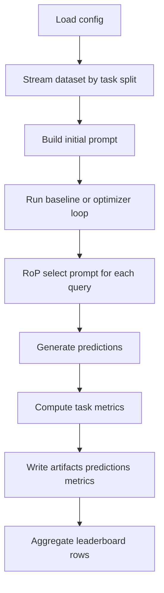

# FERMI 重現專案實作藍圖

## 1. 子任務目標與範圍

本文件用於規劃 `references/FERMI.pdf` 的可重現實作架構，限定於 LaMP 三個任務：

- `LaMP2_tag`
- `LaMP3_rate`
- `LaMP5_title`

所有後續程式碼與文件均放在 `FERMI/` 下。

本藍圖只做技術架構、檔案配置、輸出規範、設定總表欄位規格，不包含任何程式碼實作細節。

---

## 2. 現況盤點與資料格式需求

### 2.1 既有資料目錄

目前 `FERMI/LaMP/` 已具備三個 task 目錄：

- `FERMI/LaMP/LaMP2_tag/`
- `FERMI/LaMP/LaMP3_rate/`
- `FERMI/LaMP/LaMP5_title/`

每個 task 皆含：

- `train_questions.json`
- `train_outputs.json`
- `dev_questions.json`
- `dev_outputs.json`
- `test_questions.json`

### 2.2 JSON 結構觀察

#### A. questions 類檔案通用結構

整體為陣列，每筆至少含：

- `id`: 樣本 id
- `input`: 任務輸入文字
- `profile`: 使用者歷史樣本陣列（LaMP 無 explicit profile，這裡是 previous opinions）

#### B. task 特化結構

1) `LaMP2_tag`

- `profile` 元素欄位：`id`, `tag`, `description`
- 任務型態：15 類分類

2) `LaMP3_rate`

- `profile` 元素欄位：`id`, `text`, `score`
- 任務型態：1 到 5 整數評分回歸

3) `LaMP5_title`

- `profile` 元素欄位：`id`, `title`, `abstract`
- 任務型態：標題生成

#### C. outputs 類檔案通用結構

物件格式：

- `task`: 任務代號（如 `LaMP_2`, `LaMP_3`, `LaMP_5`）
- `golds`: 陣列，元素為 `{id, output}`

### 2.3 資料載入風險與需求

實測可見部分檔案非常大：

- `LaMP3_rate/train_questions.json` 讀取時觸發超過 2 GiB 限制
- `LaMP5_title/train_questions.json` 讀取時觸發字串長度上限

因此後續實作需明確採用：

1. 串流式讀取或分塊解析（禁止一次全部載入記憶體）
2. 依 split 分開處理，避免全量拼接
3. 可配置的抽樣與除錯模式（只在開發流程使用）

---

## 3. 論文重現固定設定與 baseline 範圍

### 3.1 FERMI/OPRO 關鍵超參數

- `K = 4`
- `L = 5`
- `T = 10`
- `RoP N_tilde = 3`
- `M temperature = 0.0`
- `Mopt temperature = 1.0`
- `tau(title) = 0.2`
- `tau(other tasks) = 1.0`

### 3.2 LaMP 初始化

LaMP 無 explicit user profile，採 vanilla 初始化策略。

### 3.3 baseline 範圍

僅納入 LaMP 論文報告基準：

- `Uniform`
- `Vanilla`
- `Few-shot_bm25`
- `Few-shot_cont`
- `OPRO`
- `FERMI`

---

## 4. 可實作模組化檔案結構設計

以下為建議可落地結構，供 code 模式依序建立。

```text
FERMI/
├── IMPLEMENTATION_PLAN.md
├── docs/
│   ├── CONFIG_MASTER_TABLE.md
│   ├── DATA_SCHEMA.md
│   ├── OUTPUT_SPEC.md
│   └── REPRO_CHECKLIST.md
├── configs/
│   ├── experiments/
│   │   ├── lamp2_tag.yaml
│   │   ├── lamp3_rate.yaml
│   │   └── lamp5_title.yaml
│   ├── methods/
│   │   ├── uniform.yaml
│   │   ├── vanilla.yaml
│   │   ├── fewshot_bm25.yaml
│   │   ├── fewshot_cont.yaml
│   │   ├── opro.yaml
│   │   └── fermi.yaml
│   └── shared/
│       ├── models.yaml
│       ├── metrics.yaml
│       └── runtime.yaml
├── src/
│   ├── data/
│   │   ├── io_stream.py
│   │   ├── lamp_parser.py
│   │   └── split_builder.py
│   ├── prompts/
│   │   ├── templates.py
│   │   ├── formatter.py
│   │   └── init_prompt.py
│   ├── retrieval/
│   │   ├── bm25_retriever.py
│   │   ├── contriever_retriever.py
│   │   └── rop_selector.py
│   ├── methods/
│   │   ├── uniform.py
│   │   ├── vanilla.py
│   │   ├── fewshot.py
│   │   ├── opro.py
│   │   ├── fermi.py
│   │   ├── optimizer_loop.py
│   │   └── memory_bank.py
│   ├── eval/
│   │   ├── metrics_tag.py
│   │   ├── metrics_rate.py
│   │   ├── metrics_title.py
│   │   └── evaluator.py
│   ├── runner/
│   │   ├── run_task.py
│   │   ├── run_method.py
│   │   └── run_all.py
│   └── utils/
│       ├── ids.py
│       ├── logging.py
│       ├── seed.py
│       └── io.py
├── scripts/
│   ├── reproduce_lamp.sh
│   └── aggregate_results.sh
└── results/
    └── .gitkeep
```

### 4.1 模組責任邊界

1. `data/`: 讀取、驗證、切分、格式正規化
2. `prompts/`: baseline 與優化法共用的 prompt 組裝
3. `retrieval/`: Few-shot 檢索與 RoP 選擇
4. `methods/`: 各方法核心邏輯，包含 OPRO/FERMI 優化迴圈
5. `eval/`: task 對應 metric 與統一評估介面
6. `runner/`: 單 task、單 method、批次重現入口
7. `configs/`: 實驗設定集中管理，避免硬編碼
8. `docs/`: 規格與重現證據文件

---

## 5. 實驗輸出目錄與命名規範

### 5.1 Run 命名規範

建議 `run_id`：

`{date}-{task}-{method}-{M}-{Mopt}-{seed}-k{K}-l{L}-t{T}`

範例：

`20260314-lamp2_tag-fermi-gpt35-gpt4-42-k4-l5-t10`

### 5.2 輸出目錄

```text
FERMI/results/
└── {run_id}/
    ├── config/
    │   ├── resolved_config.yaml
    │   └── config_hash.txt
    ├── logs/
    │   ├── run.log
    │   └── api_usage.json
    ├── artifacts/
    │   ├── prompt_pool.jsonl
    │   ├── memory_snapshots/
    │   └── rop_cache/
    ├── predictions/
    │   ├── dev_predictions.jsonl
    │   └── test_predictions.jsonl
    ├── metrics/
    │   ├── dev_metrics.json
    │   ├── test_metrics.json
    │   └── per_user_metrics.json
    └── summary/
        ├── run_card.md
        └── leaderboard_row.json
```

### 5.3 prediction 檔案欄位規範

每列最少欄位：

- `id`
- `task`
- `method`
- `split`
- `prediction`
- `gold`（test 若無可為 `null`）
- `is_correct`（分類任務）
- `abs_error`（評分任務）
- `rouge_l`（標題任務，若有 gold）
- `selected_prompt_id`
- `rop_neighbor_ids`

### 5.4 metrics 檔案規範

1) `LaMP2_tag`

- 主指標：`accuracy`

2) `LaMP3_rate`

- 主指標：`mae`

3) `LaMP5_title`

- 主指標：`rouge_l`

所有 metrics 檔至少包含：

- `task`
- `method`
- `split`
- `primary_metric`
- `metric_value`
- `n_samples`
- `n_users`
- `config_hash`

---

## 6. 設定總表文件欄位定義

建議維護單一總表文件：`FERMI/docs/CONFIG_MASTER_TABLE.md`。

每個實驗組態一列，欄位至少包含：

### 6.1 基本識別

- `experiment_id`
- `run_group`
- `task`
- `method`
- `status`
- `notes`

### 6.2 資料設定

- `data_root`
- `train_questions_path`
- `train_outputs_path`
- `dev_questions_path`
- `dev_outputs_path`
- `test_questions_path`
- `streaming_enabled`
- `max_samples_debug`

### 6.3 模型設定

- `model_M_name`
- `model_M_temperature`
- `model_M_max_tokens`
- `model_Mopt_name`
- `model_Mopt_temperature`
- `model_Mopt_max_tokens`

### 6.4 方法共用設定

- `seed`
- `retriever_type`
- `retrieval_topk`
- `use_profile`
- `init_prompt_strategy`

### 6.5 OPRO/FERMI 優化設定

- `K_new_prompts`
- `L_memory_size`
- `T_iterations`
- `train_ratio_for_optimization`
- `train_ratio_for_demos`
- `tau_misaligned`
- `memory_sort_order`

### 6.6 RoP 設定

- `rop_enabled`
- `rop_encoder_name`
- `rop_n_tilde`
- `rop_similarity`

### 6.7 任務評估設定

- `primary_metric`
- `secondary_metrics`
- `eval_granularity`

### 6.8 輸出與追蹤

- `run_id`
- `result_dir`
- `config_hash`
- `git_commit`
- `timestamp_start`
- `timestamp_end`

---

## 7. 實作流程藍圖



---

## 8. 後續 code 子任務可直接執行的順序

### Phase 1: 專案骨架與規格文件

1. 建立 `configs/`, `src/`, `docs/`, `results/` 目錄骨架
2. 先落地 `docs/DATA_SCHEMA.md`, `docs/OUTPUT_SPEC.md`, `docs/CONFIG_MASTER_TABLE.md`
3. 建立每個 baseline 與 task 的初版設定檔

### Phase 2: 資料層

4. 實作串流讀取器與 task parser
5. 實作 questions 與 outputs 對齊檢查
6. 實作 split 載入與 user-level 取樣工具

### Phase 3: baseline 管線

7. 先完成 `Uniform`, `Vanilla`, `Few-shot_bm25`, `Few-shot_cont`
8. 先跑 dev split 產生可驗證 predictions 與 metrics

### Phase 4: 優化法

9. 實作 OPRO 迴圈（K, L, T 固定為論文值）
10. 實作 FERMI：mis-aligned context、memory triplet、new mis-aligned count
11. 實作 RoP（`N_tilde = 3`）並接上推論流程

### Phase 5: 評估與輸出統一

12. 完成三任務 evaluator：Acc, MAE, Rouge-L
13. 統一輸出 artifacts/predictions/metrics 格式
14. 產生 `summary/run_card.md` 與 `summary/leaderboard_row.json`

### Phase 6: 重現檢核

15. 建立方法 x 任務的執行矩陣
16. 完成六種方法在三任務的完整執行
17. 彙整結果為重現表與差異註記

---

## 9. 驗收準則

1. 所有輸出均位於 `FERMI/results/`
2. 每個 run 可追溯完整設定、模型參數、seed、hash
3. 三個 task 均有可讀 predictions 與 metrics
4. baseline 僅包含指定六種
5. FERMI 參數與論文關鍵設定一致

---

## 10. 非目標與限制

1. 本文件不實作任何程式碼
2. 不擴增到非 LaMP 任務
3. 不新增論文外 baseline 到重現主表
4. 不在 `FERMI/` 以外建立任何實作資產

